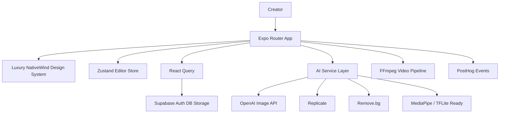

# Glam AI Clone — 8x Social Challenge

A production-ready Expo + TypeScript AI photo and video editor inspired by Glam AI, Filmora, Persona, Halo, GlowUp, and Viggle AI. The build prioritizes contest scoring: screenshot quality, Loom demo clarity, AI logs, code quality, and reflection.

## Phase Architecture

### Phase 1 — Project Setup
- Expo Router app with route groups for auth, tabs, editor, creator, and demo.
- TypeScript strict mode, NativeWind, React Query, Zustand, Supabase client, and environment examples.
- Folder structure: `app/`, `src/components`, `src/constants`, `src/data`, `src/lib`, `src/services`, `src/state`, `supabase/migrations`, and `ai-logs`.

### Phase 2 — Design System
- Luxury palette: `#000000`, `#0F172A`, `#FFFFFF`, `#FF4D8D`, `#8B5CF6`.
- Inter and Poppins typography.
- Glassmorphism cards, premium gradients, rounded Apple-style surfaces, and screenshot-first composition.

### Phase 3 — Screens
- Auth: Splash, onboarding, login, signup.
- Home: Dashboard, trending AI effects, featured filters.
- Editor: Photo editor and video editor.
- Creator tools: Story, Carousel, Reel.
- Gallery: History, saved projects, exports.
- Profile: Settings and subscription entry points.

### Phase 4 — AI Features
Service abstractions live in `src/services/ai.ts`:
- Beauty Enhancement: OpenAI Image API + Replicate fallback pattern.
- Background Removal: Remove.bg workflow.
- Object Removal: OpenAI inpainting workflow.
- AI Filters: Anime, Barbie, Cinematic, Fashion, Luxury, Magazine Cover.
- AI Reel Generator: FFmpeg-style photo-to-video pipeline.

### Phase 5 — Video Editor
`src/services/video.ts` includes timeline clips, splitting logic, export formats, and FFmpeg command planning for Story/Reel `9:16` and Carousel `4:5` outputs.

### Phase 6 — Database
SQL migrations define:
- `users`
- `projects`
- `exports`
- `ai_generations`
- `subscriptions`
- `usage_logs`

All tables include row-level security policies for user-owned data.

### Phase 7 — Screenshot Mode
Open `/demo` to load premium sample images, effects, projects, and finished edits for instant contest screenshots.

### Phase 8 — Loom Demo Mode
Demo account:
- Email: `demo@glamai.com`
- Password: `demo123`

Seed data is available in `supabase/migrations/20260530171000_demo_seed.sql`.

### Phase 9 — AI Logs
Major build prompts and responses are documented in `ai-logs/build-log.md`.

### Phase 10 — Contest Optimization
This README includes setup, architecture, screenshot checklist, Loom guide, AI logs guide, and founder reflection.

## Setup Guide

```bash
npm install
cp .env.example .env
npm run start
```

Environment variables:

```bash
EXPO_PUBLIC_SUPABASE_URL=
EXPO_PUBLIC_SUPABASE_ANON_KEY=
EXPO_PUBLIC_OPENAI_API_KEY=
EXPO_PUBLIC_REPLICATE_API_TOKEN=
EXPO_PUBLIC_REMOVE_BG_API_KEY=
EXPO_PUBLIC_POSTHOG_KEY=
EXPO_PUBLIC_POSTHOG_HOST=
```

## Architecture Diagram



## Commands

```bash
npm run start
npm run typecheck
npm run lint
```

## Testing Plan

1. Launch Expo and open `/demo`.
2. Capture hero screenshot studio screen.
3. Open Photo Editor and tap Beauty, Background Replace, Object Removal.
4. Open Video Editor and adjust trim slider.
5. Open Story, Carousel, and Reel creators.
6. Run typecheck and lint.
7. Apply Supabase migrations in a test project.
8. Create the demo auth user through Supabase Auth and run the seed migration.

## Screenshots Checklist

- [ ] Splash screen with Glam AI hero.
- [ ] `/demo` screenshot studio.
- [ ] Dashboard trending AI effects.
- [ ] Photo editor with full-screen portrait.
- [ ] AI logs visible after running an edit.
- [ ] Video editor timeline and FFmpeg export plan.
- [ ] Story creator 9:16 layout.
- [ ] Carousel creator 4:5 preview.
- [ ] Reel creator generation logs.
- [ ] Profile subscription screen.

## Loom Recording Guide

1. Start on `/demo` and explain this is screenshot mode for judges.
2. Open the main app dashboard and show trending effects.
3. Open Photo Editor, run Beauty Enhancement, then show AI logs.
4. Open Video Editor, adjust trim, show split timeline and export plan.
5. Open Reel Creator and generate a mock reel.
6. Open Gallery/Profile to show product completeness.
7. End with README, migrations, and `ai-logs/build-log.md`.

## AI Logs Guide

See `ai-logs/build-log.md` for the contest AI build log containing prompt/response pairs for each major feature.

## Reflection

Glam AI Clone is designed as a screenshot-first MVP because the 8x Social judging rubric rewards visual clarity and demo momentum. The product focuses on creator outcomes: better portraits, faster background edits, viral filters, and vertical video generation. The architecture keeps provider-specific AI details behind service abstractions, making it easy to replace mocks with production OpenAI, Replicate, Remove.bg, MediaPipe, TensorFlow Lite, and FFmpeg implementations. Supabase handles auth, persistence, storage-ready project records, AI generation logs, subscriptions, and usage telemetry. The `/demo` route and seeded demo account minimize judge setup friction and make the Loom narrative crisp.
